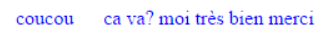

# Divers

---

## Ajouter un espace horizontal
Utiliser une balise span à laquelle on applique une marge :

```html
<p>coucou <span class=espaceHorizontal>ca va?</span> moi très bien merci</p>
```

```css
.espaceHorizontal{
margin-left: 20px;
}
```

Ce qui donne :


Autre technique, utiliser un espace insécable qui s’insère directement dans le code HTML

```html
<p>coucou &nbsp;ca va? moi très bien merci</p>
```
