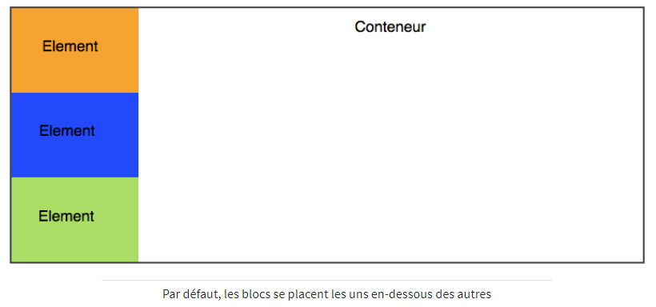
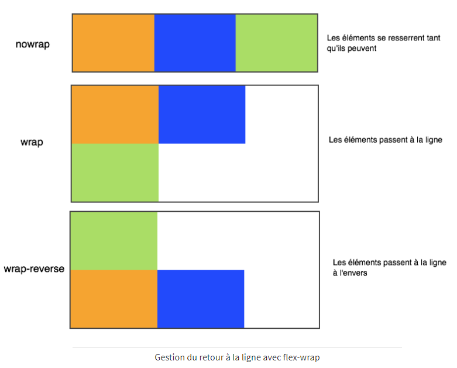
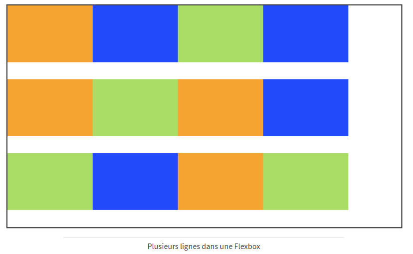

# La mise en page avec Flexbox

Il existe plusieurs façons de mettre en page un site. Au fil du temps, plusieurs techniques ont existé :
- au début, les webmasters utilisaient des tableaux HTML pour faire la mise en page (berk)
puis, CSS est apparu et on a commencé à faire une mise en page à l’aide de la propriété **float** (bof)
- une autre technique plus pratique a consisté à créer des éléments de type **inline-block** sur la page (mouais)
- aujourd’hui, une bien meilleure technique encore existe : **Flexbox** ! Elle permet toutes les folies ou presque et c’est celle qu’il vaut mieux utiliser. Flexbox est reconnu par tous les navigateurs.

----

## Un conteneur, des éléments

Le principe de mise en page avec Flexbox est simple : on définit un conteneur et à l’intérieur on y place plusieurs éléments. Sur une page web, il est possible d’avoir plusieurs conteneurs.

Le conteneur est une balise HTML, et les éléments sont d’autres balises HTML à l’intérieur :
```html
<div id="conteneur">
    <div class="element">Elément 1</div>
    <div class="element">Elément 2</div>
    <div class="element">Elément 3</div>
</div>
 ```

Par défaut, les éléments vont se mettre les uns en-dessous des autres, car ce sont des blocs. Si on met une couleur de fond aux éléments, on voit comment ils s’organisent :



----

## Soyez flex !

Découvrons Flexbox. Avec une seule propriété CSS, tout change. Cette propriété s’appelle **flex** et s’applique au conteneur. Les blocs se placent alors par défaut côte à côte.


```css
#conteneur
{
    display: flex;
}
```

### La direction

Flexbox permet d’agencer les éléments dans le sens que l’on veut avec **flex-direction** :
- *row* : organisés sur une ligne (par défaut)
- *column* : organisés sur une colonne
- *row-reserve* : organisés sur une ligne, mais en ordre inversé
- *column-reserve* : organisés sur une colonne, mais en ordre inversé

```css
#conteneur
{
    display: flex;
    flex-direction: column;
}
```

C’est pareil qu’au début, sans Flexbox mais maintenant que les éléments sont flex, ils ont un tas d’autres propriétés utiles que nous allons voir.

### Le retour à la ligne

Par défaut, les blocs essaient de rester sur la même ligne s’ils n’ont plus de place, ce qui peut provoquer des bugs de design parfois. Pour demander à ce que les blocs aillent à la ligne lorsqu’ils n’ont plus la place, il faut utiliser **flex-wrap** qui prend les valeurs :
- *nowrap* : pa de retour à la ligne (par défaut)
- *wrap* : les éléments vont à la ligne lorsqu’il n’y a plus la place
- *wrap-reverse* : les éléments vont à la ligne lorsqu’il n’y a plus la place en sens inverse

```css
#conteneur
{
    display: flex;
    flex-wrap: wrap;
}
```



----

## Alignez-les !

Les éléments sont organisés soit horizontalement, soit verticalement. Cela définit ce que l’on appelle **l’axe principal**. Il y a aussi un **axe secondaire** (appelé cross axis). Si l’axe principal est l’axe horizontal, l’axe secondaire est l’axe vertical.

**Aligner sur l’axe principal**

Partons sur des éléments organisés horizontalement (cas par défaut). Pour changer leur alignement, on va utiliser **justify-content** qui peut prendre les valeurs :
- *flex-start* : alignés au début (par défaut)
- *flex-end* : alignés à la fin
- *center* : alignés au centre
- *space-between* : les éléments sont étirés sur tout l’axe (il y a de l’espace entre eux)
- *space-around* : idem, les éléments sont étirés sur tout l’axe, mais ils laissent aussi de l’espace sur les extrémités

```css
#conteneur
{
    display: flex;
    justify-content: space-around;
}
```


Il est également possible de faire la même chose avec les éléments organisés sur l’axe verticale.
```css
#conteneur
{
    display: flex;
    flex-direction: column;
    justify-content: center;
    height: 350px; /* Un peu de hauteur pour que les éléments aient la place de bouger */
}
```

Avec une direction verticale (column), le centrage fonctionne de la même façon, cette fois en hauteur.


**Aligner sur l’axe secondaire**

Si l’axe principal est horizontal, l’axe secondaire est vertical, et inversement.
Avec **align-items**, on peut changer l’alignement sur l’axe secondaire, avec les valeurs suivantes :
- *stretch* : les éléments sont étirés sur tout l’axe (valeur par défaut)
- *flex-start* : alignés au début
- *flex-end* : alignés à la fin
- *center* : alignés au centre
- *baseline* : alignés sur la ligne de base (semblable à flex-start)

```css
/*Pour l’exemple, on part du principe que les éléments sont dans une direction horizontale.*/
#conteneur
{
    display: flex;
    justify-content: center;
    align-items: center;
}
```


**Aligner sur un seul élément**

Il est possible de faire une exception pour un seul des éléments sur l’axe secondaire avec **align-self**.
```css
#conteneur
{
    display: flex;
    flex-direction: row;
    justify-content: center;
    align-items: center;
}

.element:nth-child(2) /* On prend le deuxième bloc élément */
{
    background-color: blue;
    align-self: flex-end; /* Seul ce bloc sera aligné à la fin */
}
```


----

## Répartir plusieurs lignes

S’il y a plusieurs lignes dans la Flexbox, on peut choisir comment celles-ci seront réparties avec **align-content**. Cette propriété n’a aucun effet s’il n’y a qu’une seule ligne dans la Flexbox.
Prenons un cas d’un conteneur qui contient 12 éléments.
On autorise les éléments à aller à la ligne avec **flex-wrap** comme vu avant.
```css
#conteneur
{
    display: flex;
    flex-wrap: wrap;
}
```


Jusque-là, rien de nouveau. Voyons voir comment les lignes se répartissent avec la nouvelle propriété **align-content** , qui peut prendre les valeurs :
- *flex-start* : les éléments sont placés au début
- *flex-end*  : les éléments sont placés à la fin
- *center* : les éléments sont placés au centre
- *space-between* : les éléments sont séparés avec l’espace entre eux
- *space-around* : idem, mais il y a aussi de l’espace au début et à la fin
- *stretch* : les éléments s’étirent pour occuper tout l’espace (par défaut)


----

## Rappel à l’ordre

Sans changer le code HTML, on peut modifier l’ordre des éléments en CSS grâce à la propriété **order**. Indiquer simplement un nombre et les éléments seront triés du plus petit au plus grand nombre.
```css
#conteneur
{
    display: flex;
}
```


```css
/*Exemple de changement d’ordre :*/
.element:nth-child(1)
{
    order: 3;
}
.element:nth-child(2)
{
    order: 1;
}
.element:nth-child(3)
{
    order: 2;
}
```


----

## Encore plus flex : faire grossir ou maigrir les éléments

Avec la propriété **flex**, on peut permettre à un élément de grossier pour occuper tout l’espace restant.
```css
.element:nth-child(2)
{
    flex: 1; /* le second élément s’étire pour prendre tout l’espace */
}
```


Le nombre que l’on indique à la propriété flex indique dans quelle mesure il peut grossir par rapport aux autres. Dans l’exemple ci-dessous, le premier élément peut grossir deux fois plus que le second élément.
```css
.element:nth-child(1)
{
    flex: 2;
}
.element:nth-child(2)
{
    flex: 1;
}
```


La propriété **flex** est en fait une super-propriété qui combine **flex-grow** (capacité à grossir), **flex-shrink** (capacité à maigrir) et **flex-basis** (taille par défaut).
