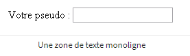
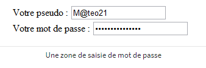
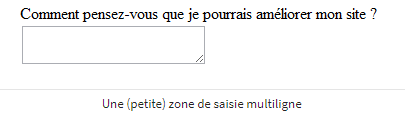
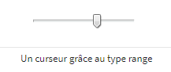

# Les formulaires
Les pages HTML peuvent être enrichies avec des formulaires interactifs qui invitent les visiteurs à renseigner des informations : saisir du texte, sélectionner des options, valider avec un bouton…  
Cependant, pour analyser les informations saisies, cela ne se fait pas en HTML, mais dans d’autres langages serveur comme par exemple le PHP.


----

## Créer un formulaire
Il faut utiliser les balises `<form>` pour insérer un formulaire dans une page HTML. Il faut obligatoirement mettre des balises de type block à l’intérieur du formulaire pour y faire figurer du texte.

```html
<p>Texte avant le formulaire</p>
<form>
   <p>Texte à l'intérieur du formulaire</p>
</form>
<p>Texte après le formulaire</p>
```


Il faut ajouter deux attributs à la balise `<form>` :
- **method** : mode d’envoi des données
  - `method=”get”` : méthode en général assez peu adaptée car limitée à 255 caractère. Les informations sont envoyées dans l’adresse de la page (http://…)
  - `method=”post”` : méthode la plus utilisée car elle permet d’envoyer un grand nombre d’informations. Les données ne transitent pas par la barre d’adresse.

- **action** : page vers laquelle le visiteur sera redirigé après envoi du formulaire et qui traitera les informations. Cette page se chargera de nous envoyer un mail avec le message ou d’enregistrer le message dans une base de donnée. Cela se fait en langage serveur. Dans l'exemple suivant, la page *traitement.php* est une page fictive.

```html
<form method="post" action="traitement.php">
   <p>Texte à l'intérieur du formulaire</p>
</form>
```

----

## Les zones de saisie basiques
Il existe deux zones de texte différentes :
- zone de texte monoligne : pour les textes courts, comme un pseudo
- zone de texte multiligne : pour les textes longs

### Pour insérer une zone de texte dans une ligne, on va utiliser la balise `<input />`.
On retrouvera cette balise plusieurs fois dans la suite de ce chapitre. A chaque fois, c’est la valeur de son attribut **type** qui va changer.
Il faut aussi donner un nom à la zone de texte, qui n’apparaît pas sur la page mais qui sera utile par la suite pour traiter l’information contenu dans le formulaire en langage serveur. Il faut utiliser l’attribut **name**.
Il faut ajouter un libellé pour indiquer au visiteur ce qu’il doit saisir dans la zone de texte, avec la balise `<label>`.
```html
<form method="post" action="traitement.php">
    <p>
        <label>Votre pseudo</label> : <input type="text" name="pseudo" />
    </p>
</form>
```


Cela n’est pas suffisant, il faut lier le label à la zone de texte.
Pour cela il faut nommer la zone de texte avec l’attribut **id** (auquel on peut mettre la même valeur qu’à l’attribut name) et ajouter l’attribut **for** avec la même valeur, au label pour le lier à la zone de texte. Ainsi, lorsqu’on qu’on clique sur le label “Votre pseudo”, le curseur se place automatiquement sur la zone de texte correspondante.

```html
<form method="post" action="traitement.php">
   <p>
       <label for="pseudo">Votre pseudo</label> : <input type="text" name="pseudo" id="pseudo" />
   </p>
</form>
```

### Quelques attributs supplémentaires
On peut ajouter d’autres attributs à la balise `<input />` pour personnaliser son fonctionnement :
- **size** : agrandir le champ
- **maxlength** : limiter le nombre de caractères que l’on peut saisir
- **value** : pré-remplir le champ avec valeur par défaut
- **placeholder** : indication sur le contenu du champ écrit en grisé qui disparaîtra quand le visiteur aura cliqué à l’intérieur du champ
- **disabled** permet de désactiver un champ pour qu'il ne soit pas modifiable
- **autocomplete** permet d'activer/désactiver l'autocomplétion


```html
<form method="post" action="traitement.php">
    <p>
        <label for="pseudo">Votre pseudo :</label>
        <input type="text" name="pseudo" id="pseudo" placeholder="Ex : Zozor" size="30" maxlength="10" />
    </p>
</form>
```

### Zone de mot de passe
On ne voit pas à l’écran les caractères saisis. Il faut utiliser l’attribut `type=”password”` avec la balise input.
```html
<form method="post" action="traitement.php">
   <p>
       <label for="pseudo">Votre pseudo :</label>
       <input type="text" name="pseudo" id="pseudo" />

       <br />
       <label for="pass">Votre mot de passe :</label>
       <input type="password" name="pass" id="pass" />    
   </p>
</form>
```


### Zone de texte multiligne
On change de balise : `<textarea></textarea>`. Il faut lui donner un nom avec **name** et utiliser un **label** qui explique de quoi il s’agit. On peut modifier la taille du `<textarea>` de deux façons :
- en CSS : appliquer les propriétés CSS **width** et **height** au `<textarea>`
- avec des attributs : **rows** et **cols** à la balise `<textarea>` qui indique le nombre de lignes de texte qui peuvent être affichées et le nombre de colonnes.

Il est possible de remplir du texte par défaut en écrivant entre les deux balises `<textarea>`.

```html
<form method="post" action="traitement.php">
   <p>
       <label for="ameliorer">Comment pensez-vous que je pourrais améliorer mon site ?</label><br />
       <textarea name="ameliorer" id="ameliorer"></textarea>
   </p>
</form>
```


----

## Les zones de saisie enrichies
HTML apportent de nouveautés aux les formulaires, avec de nouveaux types de champs. Il suffit de donner à l’attribut type de la balise `<input />` l’une des nouvelles valeurs disponibles. Tous les navigateurs ne connaissent pas ces zones de saisie enrichies. A leur place, une simple zone de saisie sera affiché (comme ci on avait écrit `type=”text”`).

### Email
```html
<input type=”email” />
```
Le champ semble identique mais le navigateur sait qu’une adresse mail est attendu et il peut afficher une indication, comme un cadre rouge, si l’adresse n’est pas un e-mail. Les navigateurs mobiles affichent un clavier adapté à la saisie d’e-mail.

### Une URL (pour saisir une adresse absolue)
```html
<input type=”url” />
```
Comme pour les e-mails, l’ordinateur sait que le visiteur est censé saisir une URL et les téléphones portables affichent un clavier adapté.

### Numéro de téléphone
```html
<input type=”tel” />
```

### Nombre
```html
<input type=”number” />
```
Il est possible de personnaliser le fonctionnement du champ avec les attributs suivants :
- **min** : valeur minimale autorisée
- **max** : valeur maximale autorisée
- **step** : pas de déplacement

### Un curseur
```html
<input type=”range” />
```
Permet de sélectionner un nombre avec un curseur. On peut aussi utiliser les attributs min, max et step.



### Couleur
```html
<input type=”color” />
```
Permet de saisir une couleur dans une palette de couleur.

### Date
Différents types de champs de sélection de date existent :
- **date** : pour la date (05/08/1985 par exemple)
- **time** : pour l’heure (13:37 par exemple)
- **week** : pour la semaine
- **month** : pour le mois
- **datetime** : pour la date et l’heure (avec gestion du décalage horaire)
- **datetime-local** : pour la date et l’heure (sans gestion du décalage horaire)

```html
<input type="date" />
```

### Recherche
```html
<input type=”search” />
```
Le navigateur décide comment afficher le champ de recherche, peut ajouter une petite loupe, et éventuellement mémoriser les dernières recherches effectuées par le visiteur.

----

## Les éléments d’options
Il y a plusieurs possibilités : les cases à cocher, les zones d’options, les listes déroulantes.

### Les cases à cocher
```html
<input type=”checkbox” />
```
N’oubliez pas de donner un nom différent à chaque case à cocher, cela permettra d’identifier plus tard lesquelles ont été cochées par le visiteur. Une case peut être coché par défaut avec l’attribut checked.
```html
<input type=”checkbox” checked />
```

### Les zones d’options
```html
<input type=”radio” />
```
Elles permettent de faire un et un seul choix parmi une liste de possibilités. Elles doivent être organisées en groupe. Les options d’un même groupe ont le même nom mais chaque option à une valeur différente.
Si on a deux zones d’options différentes, il faut donner un name unique à chaque groupe.
L’attribut **checked** est, là aussi, disponible pour sélectionner une valeur par défaut.

### Les listes déroulantes
Autre moyen de faire un choix parmi plusieurs possibilités. Fonctionnement un peu différent, avec les balises `<select></select>` qui indiquent le début et la fin de la liste avec l’attribut name pour nommer la liste.
A l’intérieur du select, une paire de balise `<option>` par choix possible avec un attribut value pour identifier le choix du visiteur.

```html
<form method="post" action="traitement.php">
   <p>
       <label for="pays">Dans quel pays habitez-vous ?</label><br />
       <select name="pays" id="pays">
           <option value="france">France</option>
           <option value="espagne">Espagne</option>
           <option value="italie">Italie</option>
           <option value="royaume-uni">Royaume-Uni</option>
           <option value="canada">Canada</option>
           <option value="etats-unis">États-Unis</option>
           <option value="chine">Chine</option>
           <option value="japon">Japon</option>
       </select>
   </p>
</form>
```

Si vous voulez qu’une option soit sélectionné par défaut, utilisez l’attribut **selected**.
On peut aussi grouper les options avec la balise `<optgroup></optgroup>`. Les groupes ne peuvent pas être sélectionné, ils servent juste à mieux organiser les différentes options.

----

## Finaliser et envoyer le formulaire

### Regrouper les champs
Avec la balise `<fieldset>`, il est possible de regrouper au sein du formulaire plusieurs champs dans un fieldset, qui peut contenir une balise `<legend>`.

```html
<fieldset>
       <legend>Vos coordonnées</legend> <!-- Titre du fieldset -->

       <label for="nom">Quel est votre nom ?</label>
       <input type="text" name="nom" id="nom" />

       <label for="prenom">Quel est votre prénom ?</label>
       <input type="text" name="prenom" id="prenom" />

</fieldset>
```

### Sélectionner automatiquement un champ
On peut placer automatiquement le curseur dans l’un des champs du formulaire avec l’attribut **autofocus**.

```html
<input type="text" name="prenom" id="prenom" autofocus />
```

### Rendre un champ obligatoire
avec l’attribut **required**.  
Le navigateur indiquera alors au moment de l’envoi qu’il doit être rempli. Les anciens navigateurs  qui ne reconnaissent pas cet attribut enverront le contenu du formulaire sans vérification. Il faudra donc compléter les tests avec par exemple des scripts JavaScript.
On dispose de pseudo-formats en CSS pour changer de style les éléments requis (**:required**) et invalides (**:invalides**), et également du focus (**:focus**).

```css
:required
{
    background-color: red;
}
```

### Le bouton d’envoi
Il reste à créer le bouton d’envoi avec la balise `<input />`. Il en existe quatre versions :
- `type=”submit”` : le principal bouton d’envoi de formulaire. C’est celui à utiliser la plupart du temps. Le visiteur est conduit à la page indiquée dans l’attribut action du formulaire.
- `type=”reset”` : remise à zéro du formulaire
- `type=”image”` : équivalent du bouton submit, présenté cette fois sous forme d’image. Ajoutez l’attribut src pour indiquer l’URL de l’image
- `type=”button”` : bouton générique qui n’aura par défaut aucun effet. En général, ce bouton est géré en JavaScript pour exécuter des actions sur la page.

On peut changer le texte affiché à l’intérieur des boutons avec l’attribut value.
```html
<input type="submit" value="Envoyer" />
```

En cliquant sur le bouton, le formulaire nous amène alors à la page indiquée dans l’attribut action. On ne peut pas créer cette page seulement en HTML. Il est nécessaire d’apprendre un langage serveur pour récupérer les informations saisies et décider quoi en faire.

### Divers

- `<input type="hidden">` permet de cacher le champ
