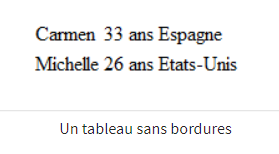
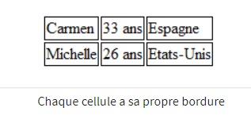
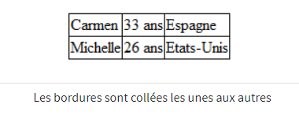
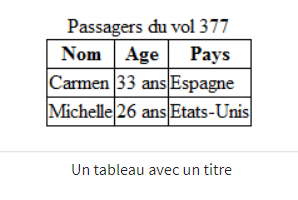
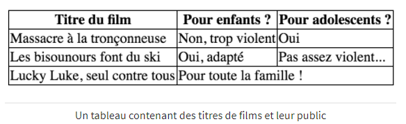

# Les tableaux

## Un tableau simple

### Un premier tableau
La première balise à connaître est `<table></table>`. Elle permet d’indiquer le début et la fin d’un tableau. C’est une balise de type bloc, il faut donc la placer en dehors d’un paragraphe.

```html
<p>Ceci est un paragraphe avant le tableau.</p>

<table>
   <!-- Ici, on écrira le contenu du tableau -->
</table>

<p>Ceci est un paragraphe après le tableau.</p>
```

`<tr></tr>` indique le début et la fin d’une ligne du tableau, `<td></td>` indique le début et la fin du contenu d’une cellule. En HTML, un tableau se construit ligne par ligne et dans chaque ligne, on indique le contenu des différentes cellules.

```html
<table>
   <tr>
       <td>Carmen</td>
       <td>33 ans</td>
       <td>Espagne</td>
   </tr>
   <tr>
       <td>Michelle</td>
       <td>26 ans</td>
       <td>États-Unis</td>
   </tr>
</table>
```

Ce qui donne :



Pour ajouter des bordures, il faut utiliser du CSS.

```css
td /* Toutes les cellules des tableaux... */
{
    border: 1px solid black; /* auront une bordure de 1px */
}
```


Pour avoir une seule bordure entre deux cellules, il faut utiliser une propriété CSS spécifique aux tableaux, **border-collapse**, qui signifie coller les bordures entre elles. Elles peut prendre deux valeurs :
collapse : bordures collés entre elles
separate : bordures dissociées (par défaut)

```css
table
{
    border-collapse: collapse; /* Les bordures du tableau seront collées (plus joli) */
}
```


### La ligne d’en-tête
Elle se crée avec un `<tr>` comme pour les autres ligne mais les cellules sont encadrés par `<th>` au lieu des `<td>`. Le navigateur met en gras le texte des cellules d’en-tête, ce qui est modifiable par CSS.

### Titre du tableau
Un tableau doit avoir un titre pour renseigner rapidement le visiteur sur le contenu du tableau, en utilisant la balise `<caption>` qui se place au tout début du tableau.

```html
<table>
   <caption>Passagers du vol 377</caption>

   <tr>
       <th>Nom</th>
       <th>Âge</th>
       <th>Pays</th>
   </tr>
   <tr>
       <td>Carmen</td>
       <td>33 ans</td>
       <td>Espagne</td>
   </tr>
   <tr>
       <td>Michelle</td>
       <td>26 ans</td>
       <td>États-Unis</td>
   </tr>
</table>
```


Il est possible de changer la position du titre en CSS avec la propriété **caption-side** qui peut prendre deux valeurs :
- *top* : titre au-dessus du tableau (par défaut)
- *bottom* : titre en dessous du tableau

----

## Un tableau structuré

### Diviser un gros tableau

- l’en-tête (en haut)  : `<thead>`
- le corps (au centre) : `<tbody>`
- le pied du tableau (en bas) : `<tfoot>`

Le pied de tableau permet par exemple de recopier l’en-tête quand le tableau est long. Il faut écrire les balises dans l’ordre suivant : thead, tfoot, tbody

### Fusion
Pour effectuer une fusion, on ajoute un attribut à la balise `<td>`. Il existe deux types de fusion :
- la fusion de colonnes : fusion horizontale. On utilise l’attribut **colspan**.
- la fusion de lignes : fusion verticale. On utilise l’attribut **rowspan**.

Il faut indiquer le nombre de cellules à fusionner entre elles, par exemple `<td colspan="2">`.

```html
<table>
   <tr>
       <th>Titre du film</th>
       <th>Pour enfants ?</th>
       <th>Pour adolescents ?</th>
   </tr>
   <tr>
       <td>Les bisounours font du ski</td>
       <td>Oui, adapté</td>
       <td>Pas assez violent...</td>
   </tr>
   <tr>
       <td>Lucky Luke, seul contre tous</td>
       <td colspan="2">Pour toute la famille !</td>
   </tr>
</table>
```


Il est possible de modifier l’alignement vertical du texte des cellules de tableaux avec la propriété **vertical-align** (cf Quelques autres techniques de mise en page).
