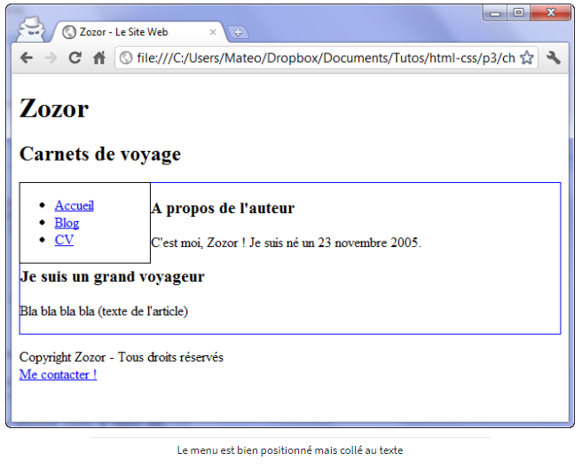
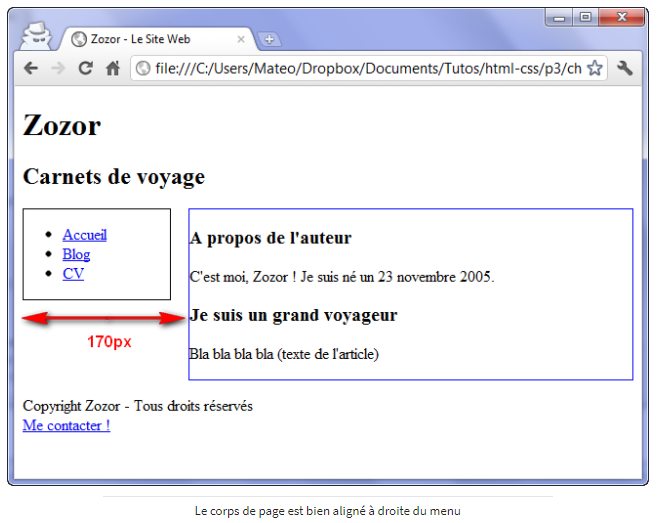
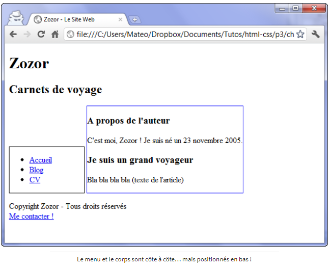
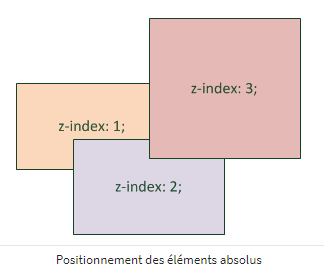
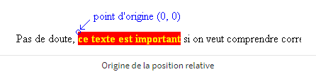
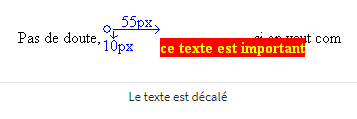

# Quelques autres techniques de mise en page

Même si flexbox est le meilleur outil de mise en page, il est important de connaître les autres techniques de mise en page, notamment pour gérer un “vieux” code.

----

## Le positionnement flottant

- Nous avons vu la propriété **float** pour faire flotter une image autour du texte, comme la première lettre d’un texte en image.
- Il se trouve que cette propriété est aujourd’hui utilisée par la majorité des sites web pour faire de la mise en page, par exemple pour placer le menu à gauche et le contenu de la page à droite. C’est a priori un bon moyen mais cette propriété n’a pas été conçue pour faire de la mise en page, elle a donc quelques défauts.

Nous avons un menu (nav) que nous allons essayer de placer à gauche et le reste du texte (section) à droite, avec un menu de 150 pixels de large. Nous ajoutons une bordure pour bien les distinguer.

```css
nav
{
    float: left;
    width: 150px;
    border: 1px solid black;
}

section
{
    border: 1px solid blue;
}
```


Il y a deux défauts :
- le texte du corps de la page touche la bordure du menu, il manque une petite marge
- plus embêtant encore, la suite du texte passe sous le menu

Pour résoudre ces deux problèmes d’un seul coup, il faut ajouter une marge extérieure à gauche de la section, marge qui doit être supérieure à la largeur du menu, par exemple 170 px.

```css
section
{
    margin-left: 170px;
    border: 1px solid blue;
}
```


A l’inverse, pour qu’un élément soit obligatoirement placé sous le menu, il faut utiliser `clear: both` qui oblige la suite du texte à se positionner sous l’élément flottant.

----

## Transformez vos éléments avec display

On va apprendre à modifier les lois du CSS !

Il existe en CSS une propriété très puissante : **display**. Elle est capable de transformer n’importe quel élément d’une page d’un type vers un autre, par exemple d’imposer aux liens (a) de type inline à apparaître sous forme de block.
```css
a
{
    display: block;
}
```

Les liens vont donc se positionner les uns en-dessous des autres (comme des blocs normaux) et il devient possible de modifier leurs dimensions.

Voici quelques-unes des principales valeurs que peut prendre la propriété **display** en CSS :
- *inline* : éléments d’une ligne, se placent les uns à côté des autres
- *block* : éléments en forme de blocs, se positionnent les uns en-dessous des autres et peuvent être redimensionnés
- *inline-block* : éléments positionnés les uns à côté des autres (comme les inline) mais qui peuvent être redimensionnés (comme les blocs)
- *none* : éléments non affichés

On peut donc décider de masquer complètement un élément de la page avec cette propriété. Exemple pour masquer les éléments qui ont la class “secret” :
```css
.secret
{
    display: none;
}
```

Pour faire apparaître ces éléments, il faudra utiliser JavaScript. Certains sites web utilisent cette technique pour masquer les sous-menus qui ne s’affichent que lorsqu’on parcourt les menus.

----

## Le positionnement inline-block

Dès qu’il y a un peu plus qu’un simple menu à mettre en page, les `clear: both` vont devenir complexe à utiliser. Une meilleure technique consiste à transformer les éléments en `inline-block`. Ils se positionnent les uns à côté des autres (exactement ce qu’on veut pour placer le menu et le corps de la page) et se peuvent avoir des dimensions précises (exactement ce qu’on veut aussi).

```css
nav
{
    display: inline-block;
    width: 150px;
    border: 1px solid black;
}

section
{
    display: inline-block;    
    border: 1px solid blue;
}
```


Ce n’est pas tout à fait ce qu’on voulait car le menu et le corps sont côte à côte mais positionnés en bas. C’est normal car les éléments inline-block se positionnent sur une même ligne de base (appelée baseline) en bas.
Il existe une propriété pour les inline-block, normalement réservé aux tableaux : **vertical-align**. Elle permet de modifier l’alignement vertical des éléments :
- *baseline* : alignement de la base de l’élément avec celle de l’élément parent (par défaut)
- *top* : aligné en haut
- *middle* : centré verticalement
- *bottom* : aligné en bas
- (valeur en px ou %) : aligne à une certaine distance de la ligne de base

Il ne reste plus qu’à aligner les deux éléments en haut en ajoutant `vertical-align: top;` dans les deux balises CSS. Pas besoin de s’embêter avec les marges et aucun risque que le texte passe sous le menu, c’est parfait !

Le corps ne prend plus toute la largeur car ce n’est plus un bloc. La section occupe seulement la place dont elle a besoin. On peut augmenter la taille de la section avec la propriété **width**.

----

## Les positionnements absolu, fixe et relatif

Il existe d’autres techniques pour positionner avec précision des éléments sur la page :
- positionnement absolu : placer un élément n’importe où sur la page (**absolute**)
- positionnement fixe : comme le positionnement absolu mais l’élément reste toujours visible même si on descend dans la page (**fixed**)
- positionnement relatif : permet de décaler l’élément par rapport à sa position normale (**relativ**)

Comme pour les flottants, les positionnements fonctionnent aussi sur des balises de type inline. Toutefois, on l’utilise le plus souvent sur des balises block.

### Le positionnement absolu

Il permet de placer un élément n’importe où dans la page.  
Il faut utiliser la propriété **position** et aussi utiliser au moins deux des quatres propriétés CSS **left** (position par rapport à la gauche de la page), **right** (position par rapport à la droite de la page), **top** et **bottom**.

```css
element
{
    position: absolute;
    right: 0px;
    bottom: 0px;
}
```

Cet exemple signifie que le bloc doit être positionné tout en bas à droite (0 pixel par rapport à la droite et 0 par rapport au bas de la page).

Les éléments positionnés en absolu sont placés par-dessus le reste des éléments de la page. Si deux éléments en absolu se superposent, il faut utiliser la propriété **z-index** pour indiquer lequel doit apparaître au-dessus. L’élément ayant la valeur z-index la plus élevée sera placé par dessus les autres.

```css
element
{
    position: absolute;
    right: 0px;
    bottom: 0px;
    z-index: 1;
}
element2
{
    position: absolute;
    right: 30px;
    bottom: 30px;
    z-index: 2;
}
```


Le positionnement absolu ne se fait pas toujours par rapport au coin supérieur gauche de la fenêtre. Par exemple un bloc A positionné en absolu dans un autre bloc B lui-même positionné en absolu (ou fixe ou relatif), le bloc A se positionnera alors dans le coin supérieur gauche du bloc B.

### Le positionnement fixe

Le principe est le même que pour le positionnement absolu sauf que le bloc reste fixé à sa position même si on descend plus bas dans la page. Cela peut-être utile par exemple pour conserver un menu en descendant dans la page.
```css
element
{
    position: fixed;
    right: 0px;
    bottom: 0px;
}
```

### Le positionnement relatif

Plus délicat, il peut vite devenir difficile à utiliser. Il permet d’effectuer des “ajustements” : l’élément est décalé par rapport à sa position initiale.  
Prenons par exemple un texte important, situé entre deux balises `<strong>`.
```css
strong
{
   background-color: red; /* Fond rouge */
   color: yellow; /* Texte de couleur jaune */
}
```


Pour déplacer ce texte, il faut utiliser une ou plusieurs propriétés **top, left, right, bottom**. Le texte va alors se déplacer par rapport au point d’origine qui se trouve en haut à gauche de l’élément.
Par exemple, pour décaler vers la droite et le bas un texte :
```css
strong
{
   background-color: red;
   color: yellow;

   position: relative;
   left: 55px;
   top: 10px;
}
```

