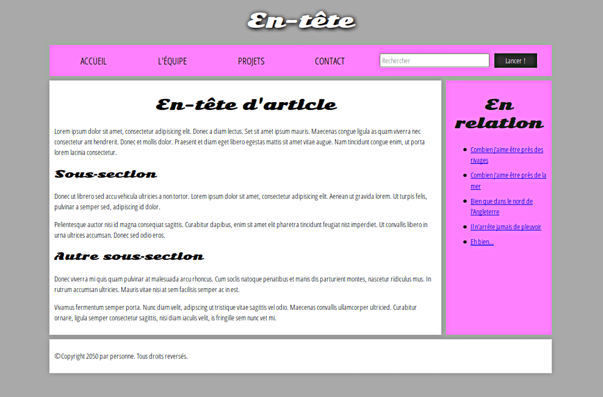

# Structurer sa page

Il est conseillé d’utiliser des balises HTML dédiées à la structuration du site. Elles ont été introduites en HTML5 et permettent de distinguer l’en-tête, le menu de navigation, etc…



Les différentes balises :
- `<header>` : en-tête
  - généralement une grande bande placée en travers au haut de la page avec un titre ou un logo
- `<nav>` : liens principaux de navigation
  - regroupe les principaux liens de navigation du site. On peut y mettre par exemple le menu principal du site
  - généralement réalisé sous forme de liste à puce à l’intérieur de la balise `<nav>`
- `<main>` : contenu principal
  - une grande zone au centre contenant la majeure partie du contenu unique de la dite page (partie variable de page en page)
  - peut-être composée de sous-sections comme des `<article>`, `<section>` et `<div>`
  - devrait être directement à la racine de `<body>` et présent une seule fois
- `<aside>` : informations complémentaires sur le côté
  - concerne souvent des informations autour du sujet, liens, citations, annonces...
  - souvent mis à l'intérieur de l'élément main
- `<footer>` : pied de page
  - se trouve généralement en bas de la page
  - on y trouve en général des informations comme des liens de contact, le nom de l’auteur, les mentions légales, etc...
- `<article>` : représente une composition autonome dans un document, par exemple un billet de blog
- `<section>` :
  - ressemble à `<article>`, mais sert plutôt à contenir une partie isolée de la page constituant un élément de fonctionnalité en soi
  - sert à regrouper des contenus en fonction de leur thématique, par exemple une section actualités, une section assistance
  - chaque section commence généralement par un titre

Ces balises peuvent être imbriquées les unes dans les autres. Par exemple, une section peut avoir sa propre en-tête.

Ces balises ne s’occupent pas de la mise en page, ce sera fait en CSS. Elles servent uniquement à bien structurer la page et à indiquer à l’ordinateur le sens du texte qu’elles contiennent. On pourrait très bien placer l’en-tête en bas de la page si on le souhaite.


Code HTML de l'image

```html
<!DOCTYPE html>
<html>
  <head>
    <meta charset="utf-8">

    <title>Intitulé de ma page</title>
    <link href="https://fonts.googleapis.com/css?family=Open+Sans+Condensed:300|Sonsie+One" rel="stylesheet" type="text/css">
    <link rel="stylesheet" href="style.css">

    <!-- Les trois lignes ci‑dessous sont un correctif pour que la sémantique
         HTML5 fonctionne correctement avec les anciennes versions de
         Internet Explorer-->
    <!--[if lt IE 9]>
      <script src="https://cdnjs.cloudflare.com/ajax/libs/html5shiv/3.7.3/html5shiv.js"></script>
    <![endif]-->
  </head>

  <body>
    <!-- Voici notre en‑tête principale utilisée dans toutes les pages
         de notre site web -->
    <header>
      <h1>En-tête</h1>
    </header>

    <nav>
      <ul>
        <li><a href="#">Accueil</a></li>
        <li><a href="#">L'équipe</a></li>
        <li><a href="#">Projets</a></li>
        <li><a href="#">Contact</a></li>
      </ul>

       <!-- Un formulaire de recherche est une autre façon de naviguer de
            façon non‑linéaire dans un site. -->

       <form>
         <input type="search" name="q" placeholder="Rechercher">
         <input type="submit" value="Lancer !">
       </form>
     </nav>

    <!-- Ici nous mettons le contenu de la page -->
    <main>

      <!-- Il contient un article -->
      <article>
        <h2>En-tête d'article</h2>
        <p>Lorem ipsum dolor sit amet, consectetur adipisicing elit. Donec a diam lectus. Set sit amet ipsum mauris. Maecenas congue ligula as quam viverra nec consectetur ant hendrerit. Donec et mollis dolor. Praesent et diam eget libero egestas mattis sit amet vitae augue. Nam tincidunt congue enim, ut porta lorem lacinia consectetur.</p>

        <h3>Sous‑section</h3>
        <p>Donec ut librero sed accu vehicula ultricies a non tortor. Lorem ipsum dolor sit amet, consectetur adipisicing elit. Aenean ut gravida lorem. Ut turpis felis, pulvinar a semper sed, adipiscing id dolor.</p>
        <p>Pelientesque auctor nisi id magna consequat sagittis. Curabitur dapibus, enim sit amet elit pharetra tincidunt feugiat nist imperdiet. Ut convallis libero in urna ultrices accumsan. Donec sed odio eros.</p>

        <h3>Autre sous‑section</h3>
        <p>Donec viverra mi quis quam pulvinar at malesuada arcu rhoncus. Cum soclis natoque penatibus et manis dis parturient montes, nascetur ridiculus mus. In rutrum accumsan ultricies. Mauris vitae nisi at sem facilisis semper ac in est.</p>
        <p>Vivamus fermentum semper porta. Nunc diam velit, adipscing ut tristique vitae sagittis vel odio. Maecenas convallis ullamcorper ultricied. Curabitur ornare, ligula semper consectetur sagittis, nisi diam iaculis velit, is fringille sem nunc vet mi.</p>
      </article>

      <!-- Le contenu « à côté » peut aussi être intégré dans le contenu
           principal -->
      <aside>
        <h2>En relation</h2>
        <ul>
          <li><a href="#">Combien j'aime être près des rivages</a></li>
          <li><a href="#">Combien j'aime être près de la mer</a></li>
          <li><a href="#">Bien que dans le nord de l'Angleterre</a></li>
          <li><a href="#">Il n'arrête jamais de pleuvoir</a></li>
          <li><a href="#">Eh bien…</a></li>
        </ul>
      </aside>

    </main>

    <!-- Et voici notre pied de page utilisé sur toutes les pages du site -->
    <footer>
      <p>©Copyright 2050 par personne. Tous droits reversés.</p>
    </footer>

  </body>
</html>        
```